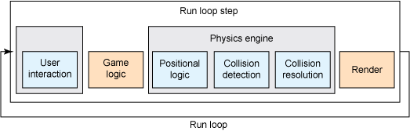

# RoboCode

This project was generated using [Nx](https://nx.dev).


# Physics Engine

# Laws

## Origin
Center origin for entities. This simplifies the rotation and collision handling.

## Coordinate System (Cartesian vs. Screen Coordinates)
Cartesian Coordinates: Right-handed coordinate system because it's easier to grasp for the majority of people.
This means that:
 - the positive x-axis points to the right, 
 - the positive y-axis points up, 
 - and the positive z-axis points out of the screen.

## Angle Measurement (Degrees vs. Radians)
Using radians internally for calculations, but degrees for UI. // TODO

## Collision Detection Method
SAT (Separating Axis Theorem): Accurate for rotated rectangles and polygons.

## Unit System (Pixels vs. Game Units)
Game Units: abstract units can be scaled to different resolutions. Right now, 1 unit = 1 pixel.

## Physics engine loop


Pseudo code:
```js
1. User Interaction
2. Positional Logic
3. Detect Collisions
4. Resolve Collisions
```